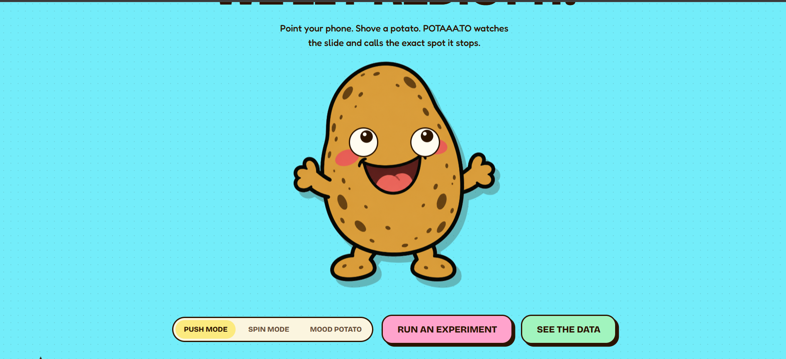
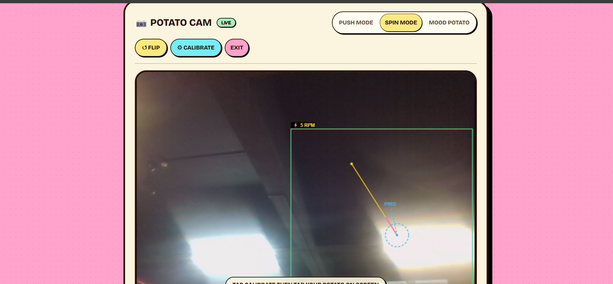
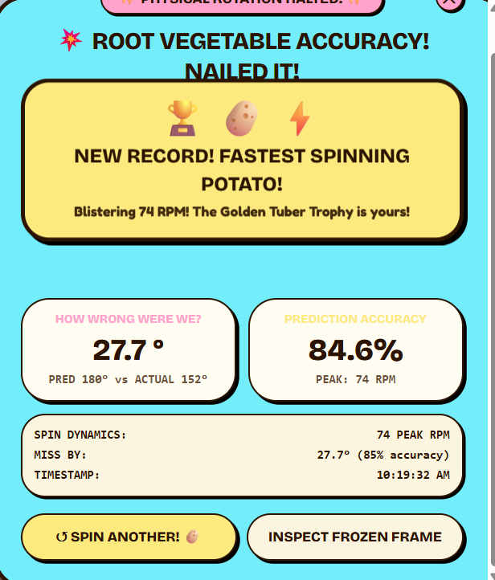

# Potaa.to 🥔🎯

Link::  https://uselessproject-cyan.vercel.app/

## Basic Details
### Team Name: Injimottai

### Team Members
- Team Lead: Joshwin James - SJCET
- Member 2: Christwin Soy Jose - SJCET

### Project Description
Potaa.to is an interactive web app where you use your phone or laptop camera to track a real potato on your desk in real-time. It uses browser-native computer vision to detect the potato, track its movement and rotation, and predict where it will end up — zero servers, zero AI APIs, just pure client-side physics.

### The Problem (that doesn't exist)
Humanity has spent centuries calculating planetary orbits and quantum particle trajectories — yet nobody has built a scientific tool to measure what happens when you flick a potato across a desk. Potato enthusiasts worldwide have been left without a way to validate their flicking accuracy, rotational RPM, or their tuber's emotional state.

### The Solution (that nobody asked for)
Potaa.to: a full-featured, zero-latency browser laboratory engineered specifically for tuber mechanics. Using real-time camera color calibration, flood-fill blob tracking, asymmetric surface landmark detection, and exponential moving average (EMA) deceleration modeling, it brings rigorous analysis to potato flicking, spinning, and mood detection.

## Technical Details
### Technologies/Components Used
For Software:
- TypeScript, JavaScript, HTML5, CSS3
- TanStack Start, React 19
- Tailwind CSS 4, Radix UI Primitives, HTML5 Canvas API, Lucide React
- Vite 8, Nitro, npm, Vercel

For Hardware:
- 1x Real Physical Potato (Russet / Yukon Gold), 1x Flat Desk, 1x Webcam or Smartphone Camera
- Potato: 50–120mm diameter; Camera: minimum 720p @ 30 FPS
- 1x Human Index Finger (no soldering iron required)

### Implementation
For Software:
# Installation
git clone https://github.com/Joshwin-James/useless_project.git
cd useless_project
npm install

# Run
npm run dev
# Screenshots 
\
  
*The image shows the home screen of the web app*

  
*The image shows the interface where the rpm is measured*

  
*This image explains the results leaderboard and all*
# Diagrams

*End-to-end client-side pipeline: Webcam stream → HSV color segmentation & blob detection → centroid & surface feature tracking → EMA physics engine (deceleration & angle unwrapping) → real-time Canvas HUD overlay & scoreboard*

For Hardware:

# Schematic & Circuit

*Potato-to-webcam interface: the organic potato (test subject) is placed on a low-friction desk surface within the optical sensor's field of view. The finger actuator applies an impulse vector. No electronic wiring involved.*

*Hardware blueprint detailing the organic starch core, asymmetric surface eye marker used for rotation tracking, frictional skin contact surface, and the webcam acquisition zone.*

# Build Photos

*Components: 1x Physical Potato (Russet), 1x Flat wooden desk, 1x Smartphone / Laptop webcam, 1x Human index finger (actuator). Software running on browser at uselessproject-cyan.vercel.app*

*Build process: Open the web app, point the camera at the potato on the desk, tap to calibrate the potato's color (HSV lock), select a mode (Push / Spin / Mood), and run the experiment.*

*Final setup: Live Potato Cam active in Spin Mode with real-time RPM readout (5 RPM), active prediction vector (PRED), and on-screen calibration prompt — the complete working system.*

### Project Demo
# Video
[Add your demo video link here]
*Demonstrates the full experiment flow: webcam color calibration, flicking the potato to predict stopping distance (Push Mode), spinning it to measure RPM (Spin Mode), and scanning its emotional state (Mood Potato).*

# Additional Demos
- Live Web App: https://uselessproject-cyan.vercel.app
- GitHub Repository: https://github.com/Joshwin-James/useless_project

## Team Contributions
- Joshwin James: Physics engine modeling (EMA deceleration, angle unwrapping), full-stack integration, UI/UX implementation, and Vercel deployment.
- Christwin Soy Jose: Concept design, computer vision algorithms (HSV flood-fill, asymmetric feature detection), camera calibration workflows, and hardware testing.

---
Made with ❤️ at TinkerHub Useless Projects 

